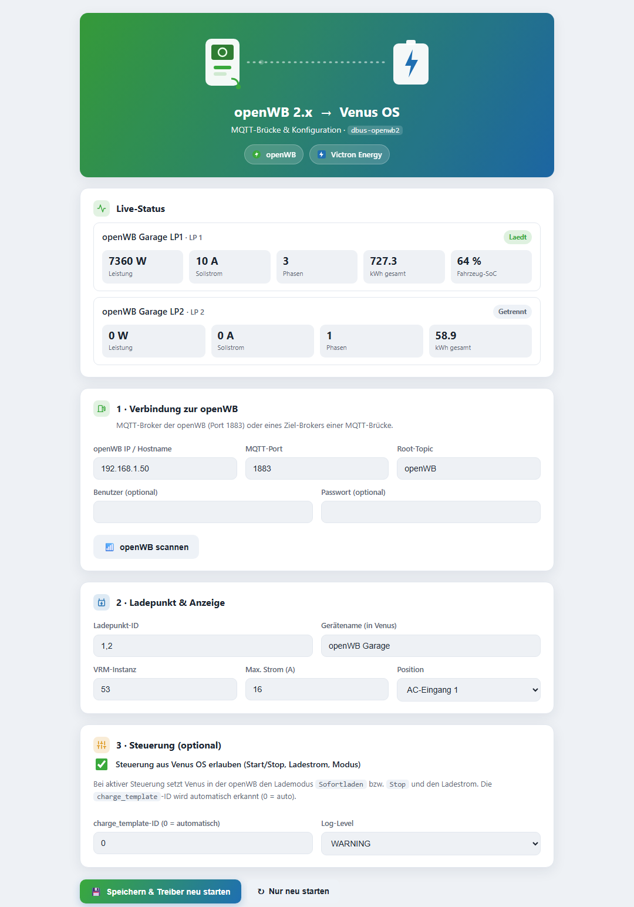
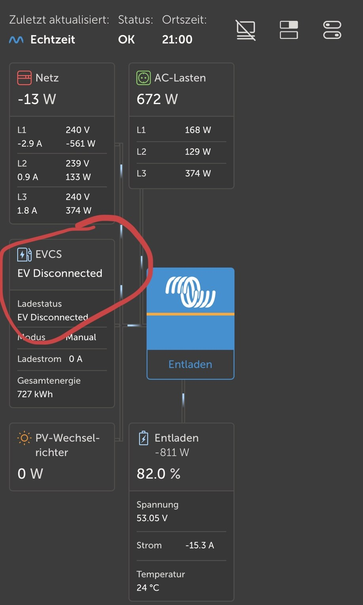

# dbus-openwb2

Integriert eine **openWB 2.x** (software2) Wallbox als Ladestation
(`com.victronenergy.evcharger`) in **Venus OS** – inklusive **dediziertem
Web-Interface** zur Konfiguration und **optionaler Steuerung** aus Venus OS.

Inspiriert von [gvzdus/dbus-mqtt-openwb](https://github.com/gvzdus/dbus-mqtt-openwb)
(nur openWB 1.9), neu geschrieben für die openWB-2-Topic-Struktur.



---

## Was es kann

- **Anzeige** der openWB in Venus-GUI und VRM: Leistung (gesamt + pro Phase),
  Energie, Ladestrom, Frequenz, Status (getrennt/verbunden/lädt), Phasenzahl
  und **Fahrzeug-Ladestand (SoC)**.
- **Zwei APIs**: die von openWB versionsstabil gehaltene **SimpleAPI** (empfohlen)
  oder die internen Topics – automatisch per Scan erkannt.
- **Mehrere Ladepunkte**: je openWB-Ladepunkt ein eigener Venus-Ladestation-Service.
- **Web-Interface** unter `http://<venus-ip>:8088`:
  - **Live-Status** (Leistung, Sollstrom, Phasen, kWh, SoC) mit Auto-Refresh
  - **Log-Viewer** – Treiber-Log im Browser, ohne SSH
  - openWB live **scannen** → erkennt Ladepunkte und Live-Werte automatisch
  - Broker, Ladepunkt-ID(s), Name, VRM-Instanz, Max-Strom, Position einstellen
  - optionaler **Passwortschutz** (HTTP Basic Auth, Passwort nur als Hash gespeichert)
  - **Speichern** schreibt `config.ini` und startet den Treiber neu
- **Steuerung (optional, abschaltbar)**: Start/Stop, Ladestrom und Lademodus
  aus Venus OS zurück in die openWB (Modus *Sofortladen* / *Stop* / *PV*).

### So sieht es in Venus OS / VRM aus



Die openWB erscheint als **EVCS-Kachel** neben Netz, Lasten, PV und Batterie
(hier mit 727 kWh Gesamtenergie).

## Voraussetzungen

- Venus-OS-Gerät (entwickelt für und getestet auf dem Cerbo GX) mit **root/SSH-Zugang**
- openWB **2.x** mit aktivem **MQTT-Broker** (Standard: Port 1883, Root-Topic `openWB`)

## Schnellinstallation (Endnutzer)

Per SSH auf dem Venus-OS-Gerät:

```bash
cd /tmp
wget -O dbus-openwb2.zip https://github.com/teesmokr/dbus-openwb2/archive/refs/heads/main.zip
unzip -o dbus-openwb2.zip
rm -rf /data/etc/dbus-openwb2
cp -R dbus-openwb2-main /data/etc/dbus-openwb2
bash /data/etc/dbus-openwb2/install.sh
```

Danach **`http://<venus-ip>:8088`** im Browser öffnen und konfigurieren.

## Installation via SetupHelper (Beta)

Wenn du den [SetupHelper](https://github.com/kwindrem/SetupHelper) von Kevin
Windrem installiert hast, kannst du `dbus-openwb2` über den **Package Manager**
verwalten (Download, Update, automatische Neuinstallation nach Firmware-Updates):

**GX-GUI → Settings → Package manager → Inactive packages → new** und eintragen:

| Feld | Wert |
|------|------|
| Package name | `dbus-openwb2` |
| GitHub user   | `teesmokr` |
| GitHub branch/tag | `main` (oder `v1.6.0`) |

Dann **Proceed / Install**. Das mitgelieferte [`setup`](setup)-Script installiert
`paho-mqtt`, legt die `config.ini` an und verlinkt beide Dienste.

> Beta: Die SetupHelper-Integration ist noch nicht auf Hardware getestet.
> Rückmeldungen willkommen. Ohne SetupHelper einfach die Schnellinstallation
> oder `install.sh` nutzen.

## Installation (manuell)

```bash
# 1. Projekt auf den Cerbo kopieren (per scp) nach:
#    /data/etc/dbus-openwb2/
# 2. Installer ausführen:
bash /data/etc/dbus-openwb2/install.sh
```

Der Installer setzt Rechte, installiert `paho-mqtt` (falls nötig), verlinkt beide
Dienste in `/service/` und trägt sich in `/data/rc.local` ein (übersteht
Firmware-Updates).

Danach im Browser: **`http://<venus-ip>:8088`** öffnen, openWB scannen,
Ladepunkt übernehmen, speichern. Fertig – die Wallbox erscheint in der Geräteliste.

## Aktualisieren (Update)

Deine `config.ini` bleibt bei allen Wegen erhalten (sie wird nie überschrieben,
nur angelegt, falls sie fehlt).

**Mit SetupHelper:** GX-GUI → **Settings → Package manager → Active packages →
dbus-openwb2 → Proceed** (bzw. „Check for updates" / „Update"). SetupHelper zieht
die neueste Version und reinstalliert automatisch.

**Manuell / Schnellinstallation:** einfach erneut ausführen – das Skript
überschreibt die Programmdateien und lässt die `config.ini` in Ruhe:

```bash
cd /tmp
wget -O dbus-openwb2.zip https://github.com/teesmokr/dbus-openwb2/archive/refs/heads/main.zip
unzip -o dbus-openwb2.zip
# Programmdateien aktualisieren, config.ini behalten:
cp -R dbus-openwb2-main/* /data/etc/dbus-openwb2/
bash /data/etc/dbus-openwb2/install.sh
```

`install.sh` erkennt eine vorhandene Installation, aktualisiert die Dienste und
startet sie neu. Danach im Browser neu laden (Strg+F5).

Aktuell installierte Version prüfen:

```bash
cat /data/etc/dbus-openwb2/version
```

## SimpleAPI vs. interne Topics

Der Treiber kann die openWB-Daten über zwei MQTT-Topic-Sätze lesen
(Einstellung **„API"** im Web-Interface bzw. `[MQTT] api_mode`):

| Modus | Topics | Vorteil |
|-------|--------|---------|
| **`simple`** (empfohlen) | `openWB/simpleAPI/…` | Von openWB **versionsstabil** gehalten; einfachere, robustere Steuerung (kein `charge_template` nötig). Muss in der openWB unter **Einstellungen → System → SimpleAPI** aktiviert sein. |
| **`internal`** (Standard) | `openWB/chargepoint/<id>/get/…` | Funktioniert ohne Aktivierung, kann sich aber je openWB-Version ändern. |

Der **Scan** im Web-Interface erkennt automatisch, welche API verfügbar ist, und
stellt bei erkannter SimpleAPI direkt darauf um. Empfehlung des openWB-Teams:
**SimpleAPI** verwenden.

## openWB vorbereiten (MQTT)

Der Treiber liest die Daten über MQTT. Es gibt zwei Wege – **Variante A ist der
Normalfall und braucht keine openWB-Einstellung.**

### Variante A – direkt mit dem openWB-Broker verbinden (empfohlen)

openWB 2.x betreibt intern einen MQTT-Broker, der im Heimnetz auf **Port 1883**
erreichbar ist. Es ist **keine Konfiguration an der openWB nötig** – einfach im
Web-Interface eintragen:

| Feld            | Wert                          |
|-----------------|-------------------------------|
| openWB IP       | IP der openWB (z. B. `192.168.1.50`) |
| MQTT-Port       | `1883`                        |
| Root-Topic      | `openWB`                      |
| Benutzer/Passwort | leer                        |

Dann **„openWB scannen"** klicken – die Ladepunkte erscheinen automatisch.

### Variante B – MQTT-Brücke (nur wenn A nicht geht)

Falls Port 1883 der openWB nicht erreichbar ist oder du die Daten bewusst an
einen **anderen** Broker (z. B. einen eigenen Mosquitto oder den auf dem Cerbo)
weiterleiten willst, richtest du in der openWB eine **MQTT-Brücke** ein:

**openWB-Menü:** `System → MQTT-Brücken → „+" (Neue Brücke)`

| Feld in der openWB      | Wert                                              |
|-------------------------|---------------------------------------------------|
| Bezeichnung             | z. B. `Venus`                                     |
| Brücke aktivieren       | **Ja**                                            |
| Entfernter Server       | IP des Ziel-Brokers (z. B. Cerbo/Mosquitto)       |
| Entfernter Port         | Port des Ziel-Brokers (Standard `1883`)           |
| Benutzername / Passwort | Login des Ziel-Brokers (falls gesetzt)            |
| Präfix                  | `openWB/`                                         |
| Client ID               | z. B. `openWB`                                     |
| MQTT Protokoll          | `v3.1.1`                                           |
| **Alle Statusdaten**    | **An**  ← wichtig, sonst kommen keine Ladepunkt-Werte |
| Datenserien für Diagramme | Aus (optional)                                  |
| Fernkonfiguration ermöglichen | nur **An**, wenn die Steuerung (Variante mit Set-Topics) über diesen Broker laufen soll |

Danach im Web-Interface als **openWB IP** die Adresse dieses **Ziel-Brokers**
eintragen (nicht die der openWB).

> ⚠️ Die openWB warnt zu Recht: Eine Brücke gibt alle weitergeleiteten Daten an
> jeden frei, der Zugriff auf den Ziel-Broker hat. Für Brücken zu externen
> Servern TLS + Login verwenden. Im rein lokalen Heimnetz (openWB → Cerbo) ist
> das meist unkritisch.

## Datenzuordnung (openWB 2.x → Venus)

| Venus-D-Bus-Pfad        | openWB-2-Topic                                    |
|-------------------------|---------------------------------------------------|
| `/Ac/Power`             | `chargepoint/<id>/get/power`                       |
| `/Ac/L{1,2,3}/Power`    | `get/powers` (bzw. `currents` × `voltages`)        |
| `/Ac/Energy/Forward`    | `get/imported` (Wh → kWh, Gesamtzähler)             |
| `/Session/Energy`       | `get/imported` − Stand beim Anstecken (Sitzung)     |
| `/Session/Time`         | Dauer seit Anstecken                                |
| `/Ac/Voltage`           | `get/voltages` (Mittelwert)                         |
| `/Current`              | `get/currents` (Maximum)                            |
| `/SetCurrent`           | `get/evse_current`                                  |
| `/NrOfPhases`           | `get/phases_in_use`                                 |
| `/Ac/Frequency`         | `get/frequency`                                     |
| `/Soc`                  | `get/connected_vehicle/soc` → `soc`                 |
| `/Session/Energy`       | `get/imported` − Stand beim Anstecken               |
| `/Session/Time`         | Dauer seit Anstecken                                |
| `/Status`               | `plug_state` + `charge_state` (+ `pv_charging` → „Warte auf Sonne") |
| `/Mode`                 | `get/connected_vehicle/config` → `chargemode`       |

## Steuerung (Venus → openWB)

Nur aktiv, wenn im Web-Interface **„Steuerung erlauben"** gesetzt ist
(`[CONTROL] enabled = 1`). Verwendete Set-Topics je API-Modus:

**SimpleAPI** (`api_mode = simple`) – einfach und stabil, kein `charge_template`:

| Venus-Aktion  | openWB-Topic                                            |
|---------------|--------------------------------------------------------|
| `/StartStop`  | `simpleAPI/set/chargepoint/<id>/chargemode` = `instant` / `stop` |
| `/SetCurrent` | `simpleAPI/set/chargepoint/<id>/chargecurrent` (6…Max A) |
| `/Mode`       | `simpleAPI/set/chargepoint/<id>/chargemode` = `instant` / `pv` / `target` |

**Interne Topics** (`api_mode = internal`):

| Venus-Aktion  | openWB-2-Topic                                                                 |
|---------------|--------------------------------------------------------------------------------|
| `/StartStop`  | `set/vehicle/template/charge_template/<tpl>/chargemode/selected` = `instant_charging` / `stop` |
| `/SetCurrent` | `set/vehicle/template/charge_template/<tpl>/chargemode/instant_charging/current` (6…Max A) |
| `/Mode`       | `.../chargemode/selected` = `instant_charging` / `pv_charging` / `scheduled_charging` |

`/MaxCurrent` ist nur ein **lokales Limit** und löst **keinen** openWB-Befehl aus.
Im internen Modus wird die `charge_template`-ID (`<tpl>`) automatisch aus
`get/connected_vehicle/config` erkannt (im Web-Interface auf `0` = auto lassen);
bei SimpleAPI entfällt das komplett.

## Name der Ladestation (EVCS-Kachel)

Der Gerätename wird im Web-Interface unter **„Gerätename"** gesetzt
(`[DEFAULT] device_name`) und landet auf dem D-Bus als `/CustomName`.

Wichtig zu wissen: Auf der **Übersichts-Kachel** (Dashboard/„Zuhause") zeigt
Victrons GUI **fest den Text „EVCS"** an – dieser Titel ist in `gui-v2`
hardcodiert (`components/widgets/EvcsWidget.qml`) und lässt sich vom Treiber aus
**nicht** ändern; das gilt für jede Ladestation, auch Victrons eigene.

Der konfigurierte Name (z. B. `openWB`) erscheint dafür an allen Stellen, die
`device.name` verwenden:

- in der **EVCS-Steuerkarte** (Kachel antippen)
- in **Einstellungen → Geräteliste**
- auf der **Gerätedetailseite**

Dort kann der Name auch direkt in der GX-Oberfläche geändert werden
(**Geräteliste → Ladestation → Name**); Venus speichert das dauerhaft.

## Wo wird die Ladestation angezeigt?

Venus OS hat zwei Oberflächen – das ist wichtig, um Verwirrung zu vermeiden:

| Oberfläche | Zeigt die openWB als EVCS-Kachel? |
|------------|-----------------------------------|
| **VRM-App / VRM-Portal** → Übersicht (*gui-v2*) | **Ja** |
| **Neue lokale UI** (*gui-v2*, Browser `http://<venus-ip>/`) → **Übersicht** | **Ja** |
| Neue UI → **Kurzansicht** (Brief-Seite) | **Nein** – nur Batterie + Solar/Netz/Lasten |
| **Klassische Remote Console** (*gui-v1*) | **Nein** – zeigt nur Netz/PV/Lasten/Batterie |

> In der neuen UI (gui-v2) unten auf **„Übersicht"** tippen – die EVCS-Kachel
> liegt auf der Übersichts-Seite, **nicht** auf der „Kurzansicht".

Dass die **klassische Remote-Console-Übersicht keine EV-Ladestationen** im
Flussdiagramm darstellt, ist eine
[bestätigte Einschränkung von Victron](https://www.victronenergy.com/blog/2022/09/13/venus-os-v2-90-generator-controls-in-vrm-remote-ve-can-rv-c-venus-os-large-and-more/)
(„the local remote console does not show EV chargers"), **kein Fehler dieses
Treibers**.

Die Ladestation ist trotzdem überall vorhanden: in der **Geräteliste**
(auch in der klassischen GUI unter *Settings → Device List*), in der **VRM-App**
und in der neuen **gui-v2**-Oberfläche.

## Fahrzeug-Ladestand (SoC)

Der Treiber liest den SoC aus openWB und legt ihn als `/Soc` auf den D-Bus –
im **Web-Interface** (Live-Status) wird er angezeigt.

Die **Venus-EVCS-Kachel selbst zeigt keinen SoC an**: Victrons EVCS-Anzeige
liest nur `/Session/Energy`, `/Status`, `/Mode` und `/Session/Time` – ein
SoC-Feld gibt es dort nicht. Das ist eine Grenze der Victron-Oberfläche, kein
Fehler des Treibers.

Der Wert ist aber nutzbar – z. B. über die **Venus-MQTT-API**:

```
N/<vrm-id>/evcharger/<instanz>/Soc
```

Damit lässt er sich in **Node-RED**, **Home Assistant** oder einem eigenen
VRM-Widget verwenden.

## Betrieb

```bash
# Treiber-Log
tail -f /var/log/dbus-openwb2/current | tai64nlocal
# Web-Log
tail -f /var/log/dbus-openwb2-web/current | tai64nlocal
# Status
svstat /service/dbus-openwb2 /service/dbus-openwb2-web
# Neustart
bash /data/etc/dbus-openwb2/restart.sh
```

Der Log-Viewer im Web-Interface zeigt dasselbe Treiber-Log direkt im Browser.
Die Logs liegen bewusst im tmpfs (`/var/log`), das schont bei Crash-Schleifen
die eMMC.

## Deinstallation

```bash
bash /data/etc/dbus-openwb2/uninstall.sh
```

## Sicherheit

Das Web-Interface ist für das **lokale Heimnetz** gedacht:

- Optionaler **Passwortschutz** (HTTP Basic Auth), Passwort nur als SHA-256-Hash
  in der (auf `600` gesetzten) `config.ini`. Ohne gesetztes Passwort ist das
  Interface im LAN offen – für ein reines Heimnetz üblich.
- Schutz gegen **CSRF** (POST verlangt JSON-Content-Type + eigenen Header und
  prüft die Origin) und gegen **XSS** (alle openWB-/Config-Werte werden escaped).
- **Kein TLS**: Bei Basic Auth wird das Passwort im Klartext übertragen. Wer das
  Interface über das Heimnetz hinaus erreichbar macht, sollte einen
  Reverse-Proxy mit HTTPS davorsetzen und den Port nicht ins Internet öffnen.

## Hinweise / Haftung

Privates Projekt, keine Gewähr. Die openWB-2-Set-Topics können sich je nach
Version unterscheiden – die Steuerung ist bewusst standardmäßig **aus** und
sollte nach dem ersten Livetest kontrolliert werden. Die VRM-Instanz (`53`)
muss eindeutig sein; bei Konflikt eine andere Zahl wählen.

`paho-mqtt` ist unter `ext/paho-mqtt/` **mitgeliefert** – die Installation
funktioniert damit auch ohne Internet/pip. Ein systemweit installiertes
paho-mqtt wird bevorzugt. `status.json` (Live-Daten) liegt im tmpfs (`/run`),
um die eMMC zu schonen.

## Credits

- [gvzdus/dbus-mqtt-openwb](https://github.com/gvzdus/dbus-mqtt-openwb) – Vorlage (openWB 1.9)
- [mr-manuel/venus-os_dbus-mqtt-*](https://github.com/mr-manuel) – ursprüngliche MQTT-Treiber
- [Victron Energy](https://github.com/victronenergy/velib_python) – `velib_python`
- openWB-2-Topic-Referenz aus [a529987659852/openwb2mqtt](https://github.com/a529987659852/openwb2mqtt)

## Beitragen

Pull Requests willkommen – insbesondere getestete openWB-2-Set-Topics für die
Steuerung über verschiedene openWB-Versionen hinweg. Siehe [CONTRIBUTING.md](CONTRIBUTING.md).
